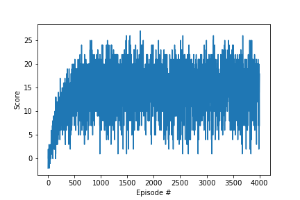

# Learning Algorithm

The algorithm for the agent is [DQN](https://arxiv.org/pdf/1312.5602.pdf)

* model.py file contains neural network definition
* dqn_agent.py file implements Agent and ReplayBuffer classes
* checkpoint.pth file contains model checkpoint 

Hyperparameters (defined in dqn_agent.py)

* ReplayBufferSize: 100000
* BatchSize: 64
* Gamma: 0.99
* Learning Rate: 0.0005
* Tau: 0.001

The network architecture consists of three fully connected (FC) linear layers where between every two layers we have a rectifier activation function (ReLU). The output of the network is the action-value for all actions for the given input state.

* The first FC layer has 37 input-channels (states)
* First ReLU layer
* The hidden FC layer has 64 input and 64 output channels
* Second ReLU layer.
* Output layer has 64 input channels and 4 output channels (actions)

# Plot of Rewards

This chart illustrates the rewards received per episode. We consider the problem solved when at least +13 are reached over 100 episodes. In our case, it took 530 episodes to achieve this goal.

# Ideas for Future Work

* I would like to use [Tensorboard for PyTorch](https://github.com/lanpa/tensorboardX)
* I would like to spend some time and train an agent from raw pixels
* I would like to spend some time and compare the performance of the agent to [Double DQN](https://arxiv.org/abs/1509.06461) and [Dueling DQN](https://arxiv.org/abs/1511.06581)
* I'm also interested in exploring [Rainbow: Combining Improvements in Deep Reinforcement Learning](https://arxiv.org/abs/1710.02298)
* Also, a colleague of mine is learning Unity and created a simple game, I'd like to apply what I learned to solve this game using RL
